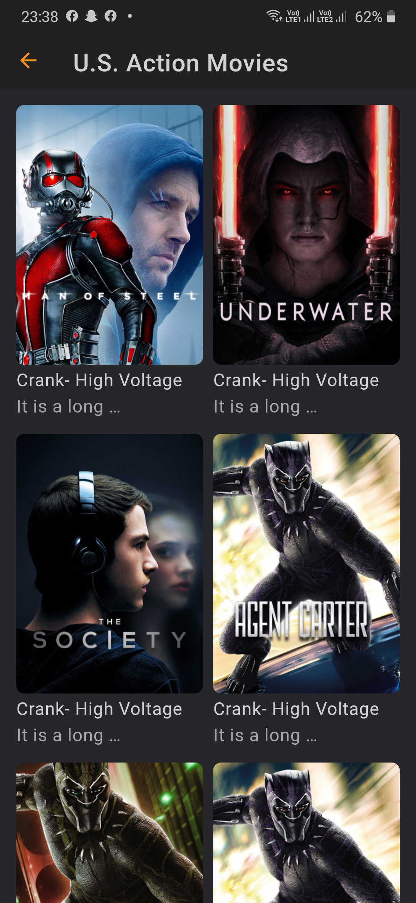

# Flix
## _movie app ui


 
Flix is a movie app that allows users to search for movies and add them to their watchlist.

- Clone it and unlock magic of flutter and firestore 

## Features

- Onboarding
- Login
- Signup
- Home
- Search
- Watchlist
- Movie details 
- Movie details 
- Settings
- About
- Feedback
- Privacy policy


## UI


<p float="left">
   
   
    
      
        
        
          
          
            
             
   
</p>


## Tech
Flix uses a number of open source projects to work properly:

- [Flutter](https://flutter.dev/) - Ui and Backend!
- [Firebase](https://firebase.flutter.dev/docs/overview/) - As database!
 
## Installation

Trackex requires [Flutter](https://flutter.dev/) v2.0+ to run.

follow this step for quick setup.

```sh
git clone https://github.com/jemisgoti/flutter-movie-app.git
cd Trackex
flutter doctor
flutter pub get
flutter run
```

For production environments...

```sh
git clone https://github.com/flutter/flutter.git
set path="path to flutter/bin"
```

## Plugins

Flix is currently extended with the following plugins.
Instructions on how to use them in your own application are linked below.

| Plugin |
| ------|
  cupertino_icons: ^1.0.2
  nb_utils: ^4.4.8
  cached_network_image: ^3.1.0
  carousel_slider: ^4.0.0
  video_player: ^2.1.4
  image_picker: ^0.8.1+3
  flutter_slidable: ^0.6.0
  google_fonts: ^2.1.0
  url_launcher: ^6.0.3

 

## Want to contribute? Great!
Follow and Contact us @
 Linkedin |  
| ------ |  
| [Whatsapp](https://wa.me/14582047711)  
| [Linkedin](https://www.linkedin.com/company/hyperone-technologies/) 
| [Instagram](https://www.instagram.com/hyperonetech/) 
| [Twitter](https://twitter.com/hyperonetech)
[Linktree] (https://linktr.ee/hyperonetech)


 ## Credit goes to

 

 Linkedin | Github
| ------ | ------ | 
| [Jemis Goti](https://www.linkedin.com/in/jemis-goti/) | [View](https://github.com/jemisgoti) |
 | [iqonic design] |


## License

MIT

**Free Software, Hell Yeah!**

 

    